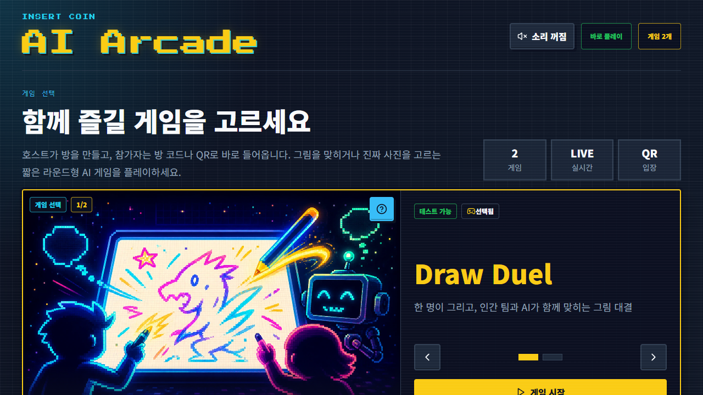
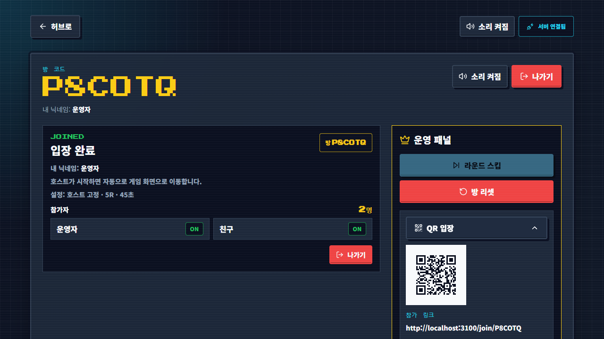
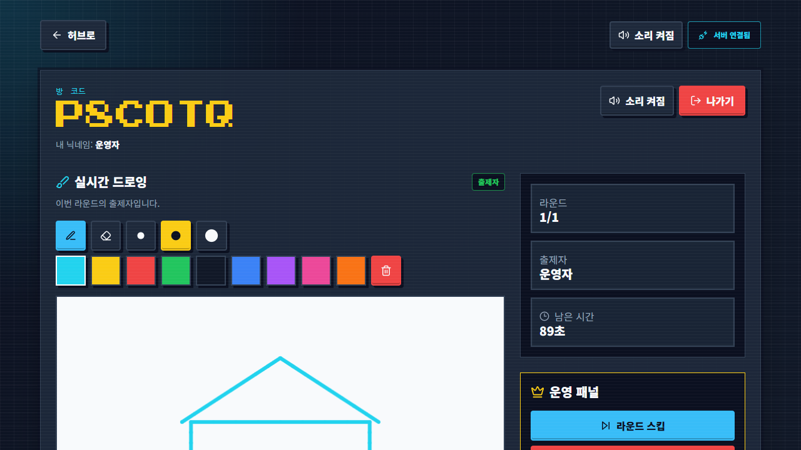
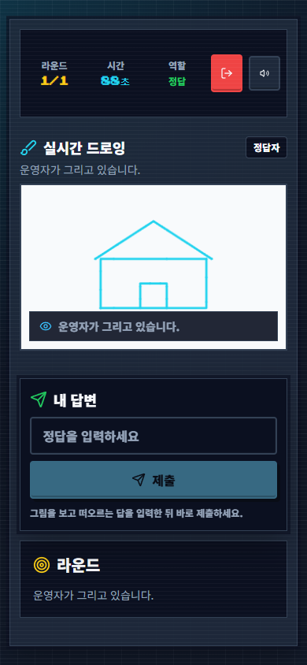
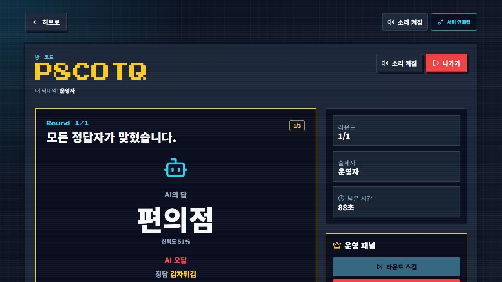
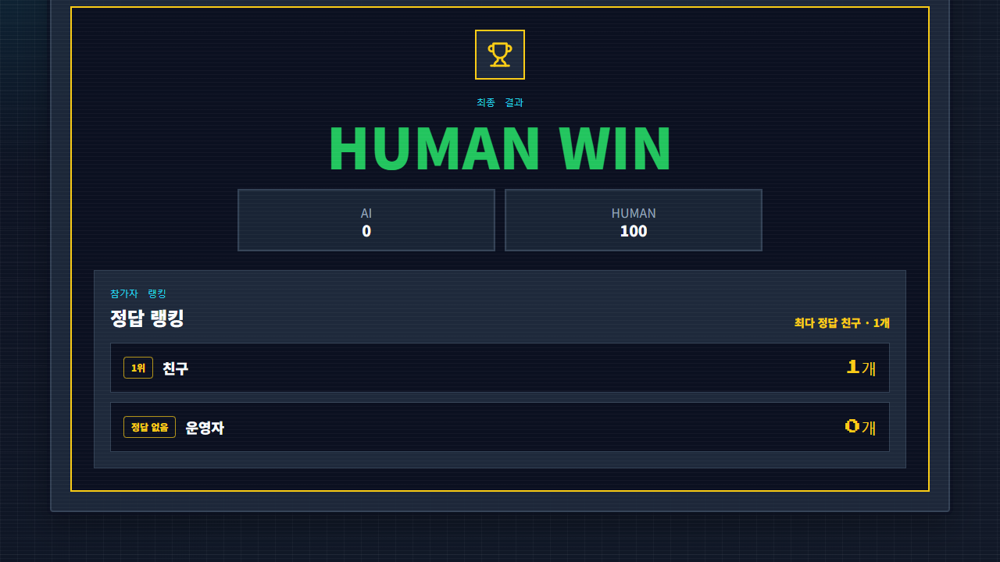
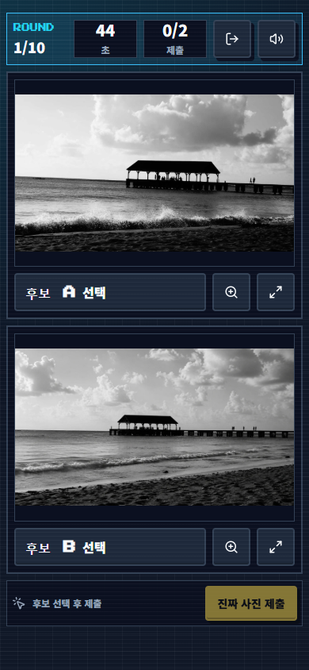

# 🕹️ AI Arcade

AI Arcade는 친구, 동료, 행사 참가자 여러 명이 **각자 자기 폰으로 접속해 함께 즐기는 웹 기반 AI 레크리에이션 게임 플랫폼**이에요. 설치할 앱도, 회원가입도 없습니다. 호스트가 방을 만들고 화면의 QR 코드를 보여주면, 참가자들은 폰 카메라로 찍고 닉네임만 입력하면 바로 게임에 들어옵니다.

레트로 오락실 감성의 화면에서 지금은 두 가지 게임을 즐길 수 있어요.

<p align="center">
  
</p>

---

## 🎨 Draw Duel — 인간 vs AI 그림 대결

한 명이 제시어를 보고 그림을 그리면, **사람 참가자와 AI가 동시에 정답을 맞히는** 실시간 대결 게임이에요. "AI보다 내가 먼저 맞힐 수 있을까?"가 이 게임의 재미 포인트입니다.

### 이렇게 플레이해요

1. **방 만들기** — 호스트가 닉네임을 정하고 방을 만들면 6자리 방 코드가 나와요. 운영 패널의 QR 코드를 열어 화면에 띄우면 참가자들이 폰으로 찍고 바로 입장합니다.

<p align="center">
  
</p>

2. **그리기** — 게임을 시작하면 출제자에게만 제시어가 보여요. 제한 시간 안에 마우스나 손가락으로 그림을 그립니다. 색상 팔레트와 지우개도 있어요. 그리는 모든 획은 참가자 전원의 화면에 실시간으로 함께 그려집니다.

<p align="center">
  
</p>

3. **맞히기** — 나머지 참가자들은 폰으로 그림이 완성되어 가는 걸 지켜보면서, 떠오르는 답을 입력해 제출해요. 먼저 맞힐수록 점수가 높습니다.

4. **AI의 차례** — 라운드가 끝나면 AI가 그림을 보고 자기 답을 내놓아요. AI가 무슨 답을 몇 % 확신으로 냈는지 모두가 함께 확인하는 순간이 이 게임에서 가장 시끄러워지는 순간입니다.

<p align="center">
  
  &nbsp;&nbsp;
  
</p>

5. **결과** — 모든 라운드가 끝나면 인간 팀과 AI의 최종 스코어, 그리고 참가자 정답 랭킹이 공개돼요.

<p align="center">
  
</p>

호스트에게는 라운드 스킵, 방 리셋 같은 운영 기능이 따로 있어서 행사 진행 중에 문제가 생겨도 게임을 계속 이어갈 수 있어요. 잠깐 연결이 끊긴 참가자는 같은 브라우저로 다시 들어오면 진행 중인 라운드로 자동 복구됩니다.

AI 추측은 기본적으로 서버 내장 Mock AI로 동작하고, 서버에 OpenAI API 키를 설정하면 **실제 그림 이미지를 보고 추측하는 AI**로 전환돼요. API 키는 서버에만 두기 때문에 참가자 화면에는 절대 노출되지 않습니다.

## 📸 Real or AI — 진짜 사진을 찾아라

비슷해 보이는 사진 두 장 중 **진짜 사진 한 장과 AI가 만든 사진 한 장**이 섞여 있어요. 제한 시간 안에 진짜를 골라내는 게임입니다. 단순해 보이지만 막상 해보면 의견이 갈려서 꽤 뜨거워져요.

### 이렇게 플레이해요

1. 호스트가 방을 만들고 라운드 수와 시간을 정해요.
2. 참가자들은 폰에서 후보 A와 B 사진을 비교해요. 돋보기 버튼으로 확대해서 꼼꼼히 뜯어볼 수도 있습니다.
3. 진짜라고 생각하는 쪽을 골라 제출하면, 라운드가 끝날 때 정답과 함께 누가 맞혔는지 공개돼요.

<p align="center">
  
</p>

모바일 화면 기준으로 설계되어 있어서, 후보 사진 두 장과 제출 버튼이 스크롤 없이 폰 첫 화면에 들어옵니다.

---

## 🚀 바로 실행하기

```bash
pnpm install
pnpm dev
```

- 게임 허브: `http://localhost:3000`
- 실시간 서버 상태 확인: `http://localhost:4000/health`

개별 실행:

```bash
pnpm --filter web dev
pnpm --filter realtime-server dev
```

같은 컴퓨터에서 브라우저 탭 두 개를 열면 혼자서도 방 생성과 참가 흐름을 바로 확인할 수 있어요.

## 친구에게 테스트 링크 공유하기

빠른 외부 테스트는 `ngrok`으로 로컬 web과 realtime-server를 각각 공개합니다.

```bash
ngrok http 3000
ngrok http 4000
```

두 ngrok URL을 받은 뒤 로컬 서버를 다시 시작합니다.

- Web 실행 환경: `NEXT_PUBLIC_REALTIME_URL=https://<realtime-ngrok-url>`
- Realtime 실행 환경: `CORS_ORIGIN=https://<web-ngrok-url>`

계속 공유할 안정 URL이 필요하면 `apps/web`은 Vercel에, `apps/realtime-server`는 Render/Fly/Railway 같은 Node 장기 실행 서버에 따로 배포합니다. 자세한 순서는 `docs/OPERATIONS.md`의 “외부 플레이 가능 환경” 섹션을 따릅니다.

## 프로젝트 상태

Phase 7(실제 AI 그림 추측) 구현이 완료된 공개 베타 안정화 단계입니다. 실제 OpenAI provider 수동 리허설과 행사 파일럿 기록만 남았습니다. 단계별 진행 상황은 `docs/ROADMAP.md`를 따릅니다.

- `apps/web`: Next.js App Router 기반 레트로 게임 허브
- `apps/realtime-server`: Socket.IO 기반 방 생성·참가 서버
- `packages/shared`: 공통 타입, 게임 레지스트리, 실시간 이벤트 payload 검증
- `games/draw-duel`, `games/real-or-ai`: 게임 명세와 구현 경계
- Draw Duel: 로비, 실시간 캔버스, 라운드·타이머·점수, AI 추측(기본 mock, `DRAW_DUEL_AI_PROVIDER=openai`로 실제 그림 snapshot 기반 OpenAI vision 추측 — timeout·retry·circuit breaker·mock fallback 포함), QR 운영 패널, 재접속 복구
- Real or AI: 로비, 설정, 라운드 진행, 점수, 모바일 우선 판별 화면
- 부하 스모크: Draw Duel 120 clients/1 room, Real or AI 120 clients/1 room Socket.IO 시나리오 스크립트

## 검증 명령

```bash
pnpm lint
pnpm typecheck
pnpm test
pnpm build
pnpm e2e
pnpm e2e:serial
```

공개 베타 플레이어 벤치마크 기준과 점수표는 `docs/PUBLIC_BETA_BENCHMARK.md`를 따른다.
전체 공개 베타 게이트는 아래 명령으로 실행한다.

```bash
pnpm benchmark:public-beta
```

부하 스모크는 realtime-server가 실행 중일 때 별도로 실행합니다. 전체 공개 베타 스모크는 Draw Duel과 Real or AI를 연속으로 확인합니다.

```bash
pnpm benchmark:load-smoke
pnpm benchmark:load-smoke:all
pnpm benchmark:load-smoke:draw-duel
pnpm benchmark:load-smoke:real-or-ai
```

이 결과는 120명 운영 보장이 아니라 로컬/행사 환경 점검용 스모크 결과로만 기록합니다.

## 개발 원칙

- 게임별 기능은 `games/{game-id}` 경계를 유지합니다.
- 공통 타입과 이벤트 payload는 `packages/shared`에서 관리합니다.
- 실시간 방 상태, 정답 판정, 점수 계산은 클라이언트가 아니라 서버 기준으로 처리합니다.
- Mock AI는 `apps/realtime-server` 내부에서만 실행하며, AI API 키는 클라이언트에 노출하지 않습니다.
- 운영 기능은 별도 로그인 없이 방 호스트 권한으로만 처리합니다.
- 재접속 복구는 같은 브라우저 `sessionStorage` 기반이며 DB 저장 복구는 하지 않습니다.

## 다음 단계

1. 실제 행사 네트워크 30~50명 리허설 기록
2. 배포 환경에서 `pnpm benchmark:load-smoke:all`에 준하는 Socket.IO 스모크 재확인
3. Draw Duel의 Mock AI를 실제 이미지 기반 AI 추측으로 전환하는 별도 리허설
4. 새 게임 후보는 사용자 아이디어 확정 후 별도 Phase로 정리
5. Redis adapter, DB 저장, 관리자 대시보드는 별도 Phase에서 검토
